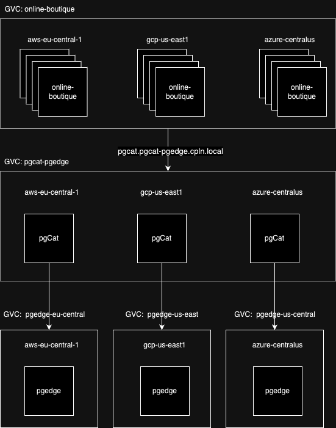

## Helm chart for online-boutique on Control Plane

This example creates an [Online Boutique](https://github.com/GoogleCloudPlatform/microservices-demo) microservices demo-application on Control Plane with supported backend of choice, either Redis or PostgreSQL (pgEdge).

It's recommended to run the example with a multi-master PostgreSQL setup to preserve availability in case of regional or cloud failures.

### Steps to run this example:

The [Helm CLI](https://helm.sh/docs/intro/install/#through-package-managers) and [Control Plane CLI](https://docs.controlplane.com/reference/cli#install-npm) must be installed.

* To deploy with [PostgreSQL (pgEdge)](#online-boutique-with-postgresql-pgedge)
* To deploy with [Redis](#online-boutique-with-redis)

#### Online Boutique with PostgreSQL (pgEdge)



1. Clone this repository and modify the `values-pgedge.yaml` file as needed. 

   **Tracing configuration**
   - If not changed, tracing is enabled with Control Plane tracing specified under `tracing.controlplane` 
   - To switch to tracing with OTEL to Datadog:
     - Uncomment `tracing.otel` section in `values-pgedge.yaml` 
     - Replace `DD_API_KEY_VALUE` and `DD_SITE_VALUE` with the respective values(Can be found in your Datadog account)
     - Comment out the `tracing.controlplane` section
   - To disable tracing entirely, comment out the entire `tracing` section in the values-pgedge.yaml file.

2. Run the command below from this directory.

   ```bash
   cpln helm install online-boutique-pgedge -f values-pgedge.yaml
   ```

#### Online Boutique with Redis


1. Clone this repository and modify the `values-redis.yaml` file as needed

   **Tracing configuration**
   - If not changed, tracing is enabled with Control Plane tracing specified under `tracing.controlplane` 
   - To switch to tracing with OTEL to Datadog:
     - Uncomment `tracing.otel` section in `values-pgedge.yaml` 
     - Replace `DD_API_KEY_VALUE` and `DD_SITE_VALUE` with the respective values(Can be found in your Datadog account)
     - Comment out the `tracing.controlplane` section
   - To disable tracing entirely, comment out the entire `tracing` section in the values-pgedge.yaml file.


2. Run the command below from this directory.

   ```bash
   cpln helm install online-boutique-redis -f values-redis.yaml
   ```


### Cleanup

**For PostgreSQL (pgEdge)**

```bash
cpln helm delete online-boutique-pgedge
```

**For Redis**

```bash
cpln helm delete online-boutique-redis
```
