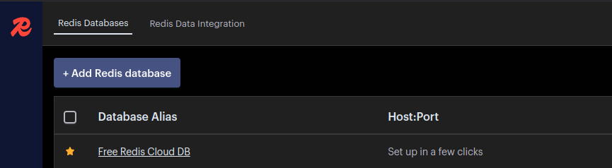

# Redis Insight

[Redis Insight](https://redis.io/insight) is a dashboard for visualizing Redis workloads running anywhere.

## Steps to run this example:

**HELM**

The [Helm CLI](https://helm.sh/docs/intro/install/#through-package-managers) and [Control Plane CLI](https://docs.controlplane.com/reference/cli#install-npm) must be installed.

1. Clone this repo and update the [values.yaml](values.yaml) file as needed.

2. Run the command below from this directory.

   ```bash
   cpln helm install redis-insight --gvc mygvc [--org myorg]
   ```

## Adding your Redis Workload to Insight
Once deployed, visit the canonical endpoint for your workload.
Click the "Add Redis database" button as shown below.


A modal will appear

If you're using Redis Sentinel, choose "Redis Sentinel" at the bottom of the modal, and enter the one of the sentinel hosts
in the "Host" input.

Otherwise, simply enter the local hostname for replica 0 of your Redis workload: e.g. `redis://redis-0.redis`
## Securing Insight

Insight doesn't support authentication natively, so you'll need to secure it either by running an auth workload
as a reverse proxy, or with network-level security (e.g. only allow internal access, and 
provide a secure VPN connection into Control Plane through e.g. [Tailscale](../../tailscale))

